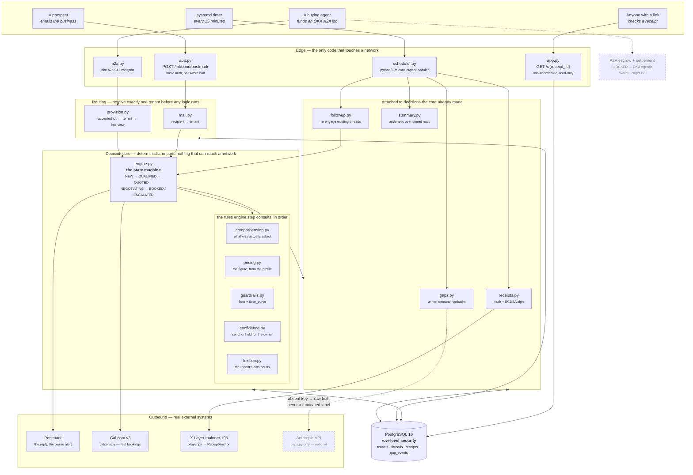
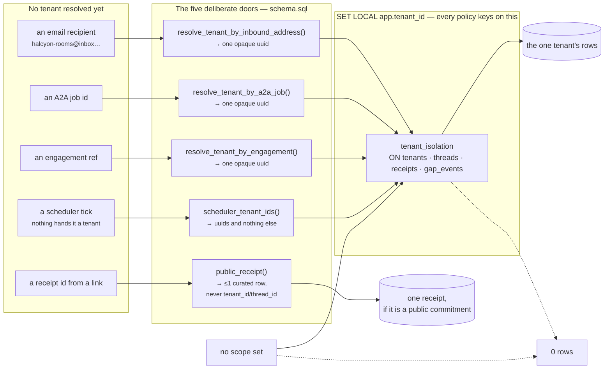
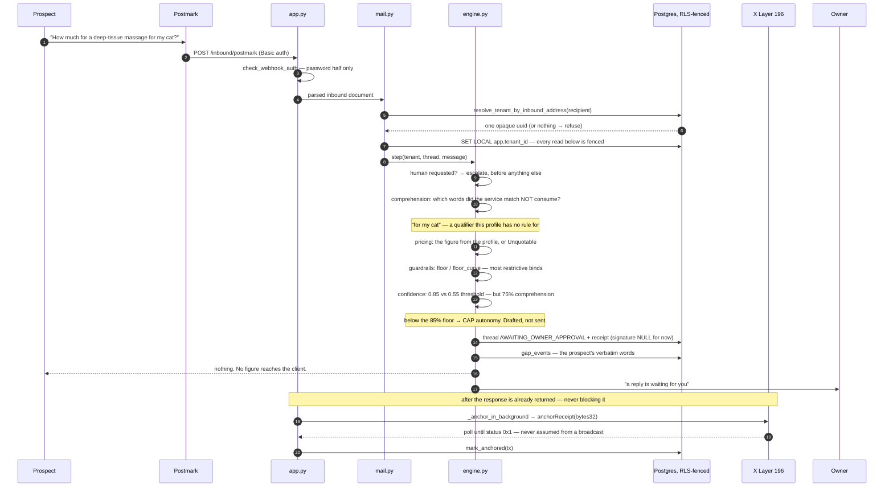

# Architecture

Three diagrams. The first is what the system is, the second is the one boundary everything else
rests on, and the third is what happens to a single stranger's email — because that path is where
every claim in the README is either true or not.

Every box below is a real module in this repo. Nothing is aspirational: where a capability is
blocked, it is drawn as blocked.

---

## 1. The system

Four ways in, one decision core, one database, and nothing in the core that can reach a network.

**The line that matters** is the one between `core` and `out`: `pricing.py`, `guardrails.py`,
`comprehension.py`, `confidence.py` and `lexicon.py` import nothing that could reach a network.
A price is arithmetic over the tenant's stored profile or it does not exist. The single LLM
consumer in the whole codebase is `gaps.py`, and it runs *after* the fact, on a schedule, to put a
coarse label on an escalation that already happened — with no key it returns `None` and the owner's
summary shows the prospect's raw words instead.

---

## 2. The isolation boundary

`store.py` contains no `WHERE tenant_id = ?` clause anywhere. That absence is the proof, not an
oversight: isolation is a PostgreSQL policy on a transaction-scoped setting, so a query that forgets
to scope itself returns **zero rows**, never someone else's.

Which leaves one problem — resolution has to happen *before* a scope exists. That gap is crossed by
five named `SECURITY DEFINER` functions and nothing else.

**Two roles, and neither can do the whole job.**

| | `concierge_app` — internet-facing | `concierge_worker` — the timer |
|---|---|---|
| table grants | SELECT/INSERT/UPDATE, under RLS | **none at all** |
| `scheduler_tenant_ids()` | REVOKEd | EXECUTE |
| can pin `app.tenant_id` | yes | — |
| owns tables / BYPASSRLS | never | never |

The webhook role can read a tenant it has resolved but cannot enumerate tenants; the worker role can
list every tenant id and do nothing with them. Per-tenant work goes back through the normal
RLS-fenced session as `concierge_app`. A compromise of the public webhook is therefore not "read
every tenant" — which is exactly what a single role holding both capabilities would have made it.

---

## 3. One stranger's email, end to end

The path all of the above exists to make safe. Note where it *stops*.

Steps 9–14 are the whole product. A quote that clears every check sends itself, carries the AI
disclosure on line one and a link to its own public receipt, and is anchored on mainnet moments
later. A quote that does not clear them goes to the owner instead — and the *reason* it stopped is
recorded on the receipt as three named signals with their weights, not as a model's opinion of its
own certainty.

---

## Where each claim is proven

Every box above is exercised by a suite that prints its raw evidence. `python3 verify.py --suite <name>`:

| Diagram element | Suite |
|---|---|
| the RLS boundary, the doors, the two roles | `isolation`, `scheduler` (checks 8–9) |
| profile → questions → stored profile | `onboarding` |
| the state machine and its guardrails | `engine` |
| comprehension caps autonomy | `comprehension` |
| confidence sends or holds | `autonomy` |
| the decaying floor | `floor-curve` |
| re-engagement, never cold outbound | `follow-up` |
| Postmark in and out | `email` (live round-trip proven 2026-07-25) |
| Cal.com — a real booking, then cancelled | `booking` |
| X Layer mainnet anchoring + tamper attacks | `receipts` |
| the public receipt page and what it refuses | `public-receipts` |
| the timer's three jobs | `scheduler` |
| unmet demand, verbatim | `product-gaps` |
| accepted A2A job → working tenant, unattended | `provisioning` |
